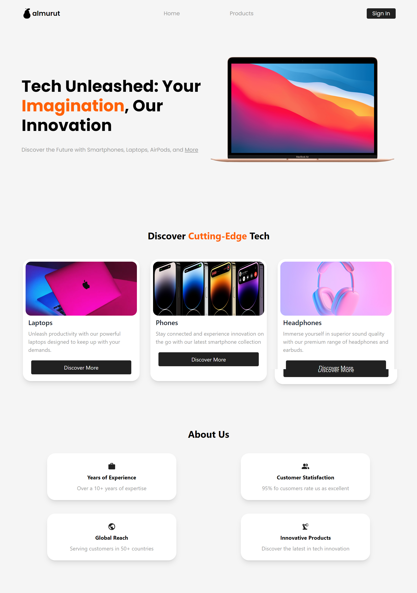
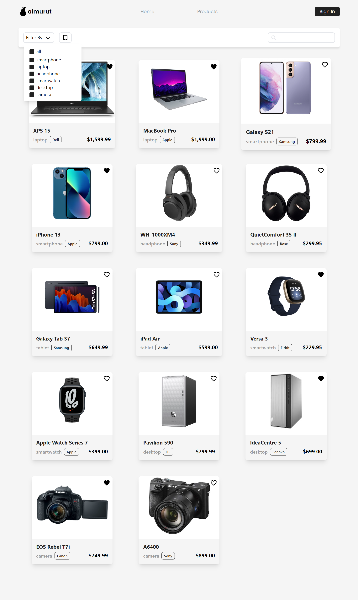
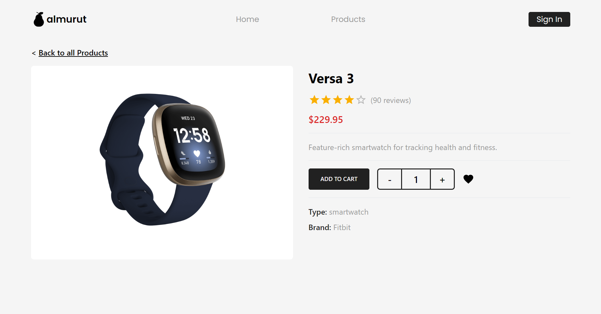

# Almurut Store - Tech Products Website

Welcome to Almurut Store, your premier destination for cutting-edge tech products. Our web platform, powered by React and Vite, offers a seamless and immersive shopping experience for tech enthusiasts. Explore a diverse range of products, from the latest gadgets to high-performance electronics.

### Watch DEMO https://dias-almurut-store.netlify.app

## Features

- **User-Friendly Interface:** Our website is designed with a clean and intuitive interface, ensuring a smooth and enjoyable browsing experience.

- **Extensive Product Catalog:** Discover a wide array of tech products, including smartphones, laptops, wearables, audio devices, and more. Our catalog is carefully curated to bring you the latest and most innovative gadgets on the market.

- **Detailed Product Pages:** Each product is showcased with detailed specifications, high-quality images, and customer reviews to help you make informed purchasing decisions.

- **Responsive Design:** Almurut Store is built with a responsive design, ensuring a consistent and visually appealing experience across various devices, including desktops, tablets, and smartphones.

## Getting Started

Follow these simple steps to explore the Almurut Store website on your local machine:

0. Clone this repository

1. Navigate to the project directory:

   ```bash
   cd ./almurut-store-app
   ```

2. Install dependencies using Yarn:

   ```bash
   yarn
   ```

3. Start the development server:

   ```bash
   yarn dev
   ```

4. Open your browser and go to [http://localhost:5173/](http://localhost:5173/) to experience Almurut Store firsthand.

## Screenshots

### Home Page



The home page serves as a gateway to the world of tech, featuring highlighted products and the latest tech trends.

### Product Page



Explore our extensive product catalog on the product page, where you can filter and search for specific items that match your interests.

### Product Item Page



Dive deeper into individual products on the item page, where you'll find comprehensive details, pricing information, and the option to add items to your cart.

## License

This project is licensed under the [MIT License](LICENSE). Feel free to use, modify, and distribute the code for your own purposes.

Thank you for choosing Almurut Store! If you have any questions or feedback, don't hesitate to reach out. Happy shopping!
